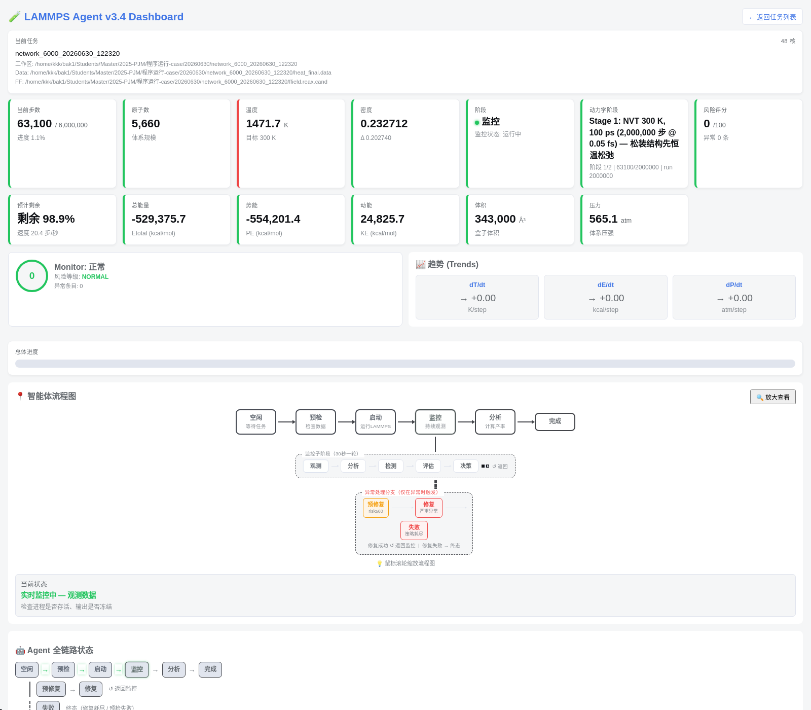
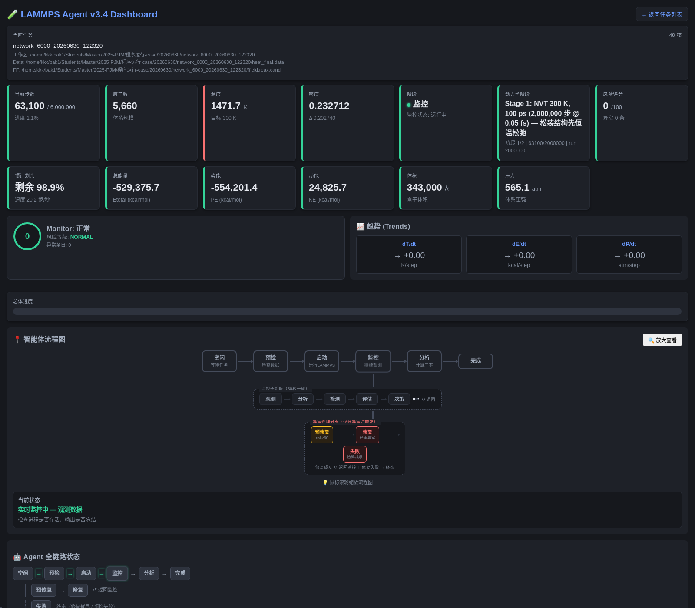
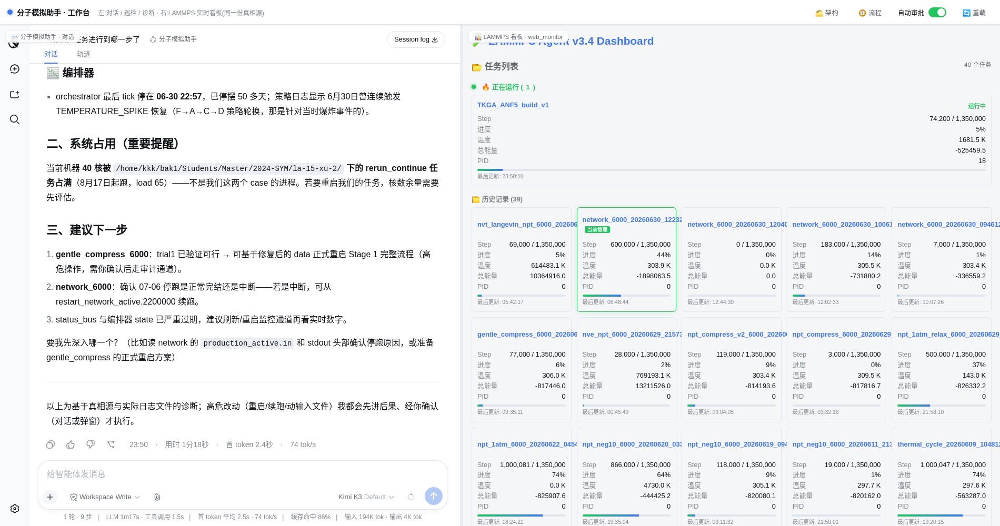

<div align="center">

# DSH MD Tools

**让大模型安全地"看懂"分子动力学模拟 —— 分子模拟助手的外围工具集**

实时监控看板 · MCP 只读桥 · 相位机可视化 · 主题同步

[](LICENSE)
[]()
[]()
[]()

</div>

---

## 这是什么

跑 LAMMPS 长任务时，你是不是也这样：`tail -f log.lammps` 刷到眼花，温度飞了半小时才发现，算完才发现力场拿错？

**DSH MD Tools** 给 LLM 智能体（基于 [DSH (DeepSeek Harness)](https://www.npmjs.com/package/@deepseek-ai/dsh)）装上一双眼睛：

- 📊 **实时看板**：步数 / 温度 / 能量 / 压强 / 密度一屏尽览，智能体相位机与 MONITOR 五子相位（观测→分析→检测→评估→决策）全程可视
- 🔌 **MCP 只读桥**：8 个工具让大模型随时查询模拟状态，**只读**设计，唯一的写门 `sim_exec` 走白名单 + 逐条审批
- 🖥️ **工作台**：左边和分子模拟助手对话，右边看板实时跳动，同一份真相源
- 🌗 **主题同步**：看板自动跟随 DSH 的深浅主题，0.5 秒内切换，保留滚动位置

零依赖 —— 只用 Python 标准库 + 原生 HTML/JS，拷走即用。

## 实拍

| 看板 · 浅色 | 看板 · 暗色（跟随 DSH 主题） |
|:---:|:---:|
|  |  |

| 工作台：左 分子模拟助手对话 · 右实时看板 |
|:---:|
|  |

> 图中为真实运行案例：5660 原子聚合物前驱体体系 300K 恒温松弛（共 200 万步），当前 63,100 步、1471.7K、风险评分 0、相位机处于 MONITOR 观测态。

## 快速开始

```bash
# ① 看板（:8080）
export AGENT_KIT_DIR=/path/to/your/agent_deploy_kit   # 智能体套件目录
export RUN_CASE_DIR=/path/to/your/run-cases           # 可选，默认 $AGENT_KIT_DIR/production
python3 dashboard/web_monitor.py 8080

# 浏览器打开
#   http://127.0.0.1:8080/           看板
#   http://127.0.0.1:8080/workbench  工作台（对话 + 看板双栏）

# ② MCP 只读桥（接入 DSH）
cp mcp/md_config.example.json mcp/md_config.json
# 编辑 md_config.json 填入你的路径，支持 local / ssh 两种模式
```

### 环境变量

| 变量 | 说明 | 默认 |
|---|---|---|
| `AGENT_KIT_DIR` | 智能体套件目录（含 `.v3.3_state.json`） | `~/agent_deploy_kit` |
| `RUN_CASE_DIR` | 运行案例根目录 | `$AGENT_KIT_DIR/production` |
| `DSH_SETTINGS` | DSH 的 settings.yaml 路径（主题同步用） | `../.dsh/settings.yaml` |
| `WEB_HOST` | 绑定地址 | `127.0.0.1`（局域网暴露设 `0.0.0.0`） |

## MCP 工具一览

| 工具 | 用途 | 权限 |
|---|---|---|
| `sim_status` | 当前步数 / 温度 / 相位机状态 | 只读 |
| `sim_context` | 任务上下文（力场、数据文件、目录） | 只读 |
| `sim_strategy_log` | 策略 / 决策历史 | 只读 |
| `sim_orchestrator_log` | 编排日志 | 只读 |
| `sim_recent_ops` | 最近操作审计 | 只读 |
| `read_paper` | 读取文献附件 | 只读 |
| `open_monitor` | 打开看板 | 只读 |
| `sim_exec` | 执行命令 | 🔒 写门：白名单 + 逐条审批 |

## 安全设计

- **只读优先**：除 `sim_exec` 外全部只读；写门命令白名单过滤（禁 bash/sh/nohup/setsid），审计落盘
- **默认本机绑定**：看板只听 `127.0.0.1`，暴露局域网需显式设 `WEB_HOST`
- **凭证隔离**：真实配置（`md_config.json`）被 `.gitignore` 排除，仓库内只有模板

## 适用场景

- 材料热 / 力性能评估的长时间 MD 任务值守
- 生物药物、纳米材料体系的多任务批量监控
- AI4Science 智能体工作流的可观测性层

## 许可证

Apache-2.0，见 [LICENSE](LICENSE)。第三方声明见 [NOTICE](NOTICE)。

> 本仓库为外围工具集。多智能体编排内核（相位机决策逻辑、物理门、受控写桥）不在本仓库内。
